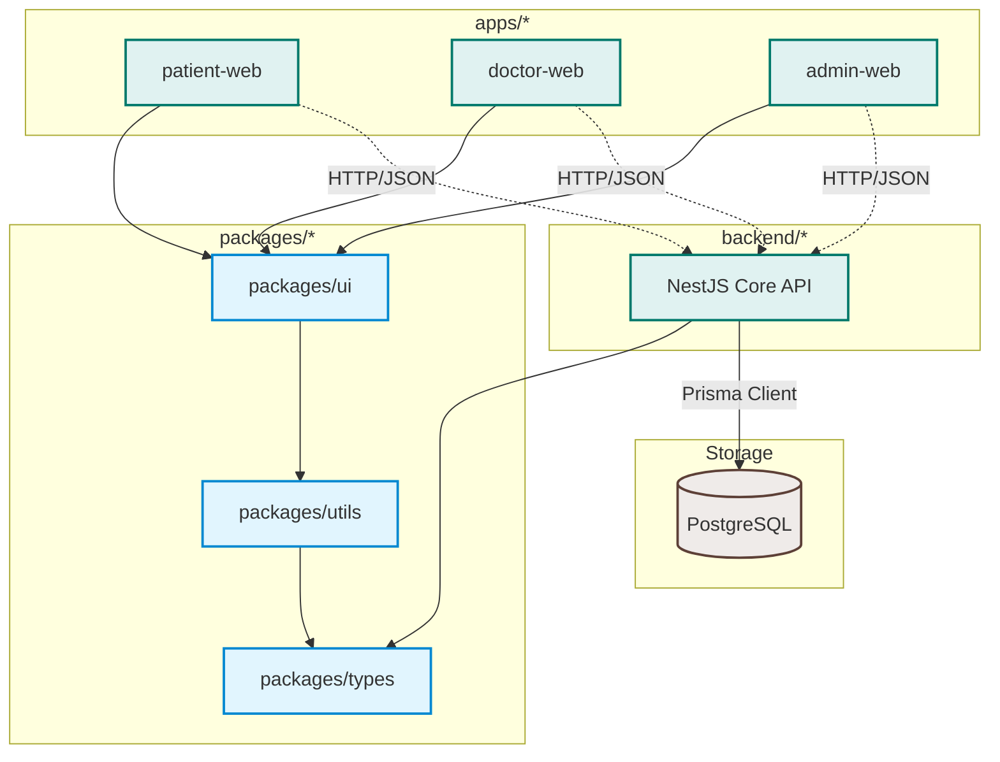

# AyuNet System Architecture

This document describes the high-level system design and architectural principles governing the AyuNet Digital Healthcare Platform.

---

## 🏗️ High-Level Topology

AyuNet is designed as a modular monorepo separated into consumer frontends, API backends, and shared libraries.

---

## 📦 Package Domain Boundaries

To prevent dependency loops and keep compile times low, shared workspaces observe strict rules:

1. **`packages/types`**
   - **Responsibility**: Pure Type system declarations. Absolutely no runtime Javascript code.
   - **Allowed Imports**: None (self-contained).
   - **Consumers**: `packages/utils`, `packages/ui`, `backend`, `apps/*`.

2. **`packages/utils`**
   - **Responsibility**: Pure utility helper functions (e.g. string manipulation, date formatting, mathematical calculations).
   - **Allowed Imports**: `@ayunet/types`.
   - **Consumers**: `packages/ui`, `backend`, `apps/*`.

3. **`packages/ui`**
   - **Responsibility**: Presentational UI components. Avoid embedding business logic or API fetch hooks here.
   - **Allowed Imports**: `@ayunet/types`, `@ayunet/utils`.
   - **Consumers**: `apps/*`.

---

## 🔌 API & Integration Layer

- All frontends communicate with the NestJS Core Backend via RESTful APIs.
- Real-time signaling (e.g. caregiver chat, emergency alerts) is allocated to WebSockets.
- Heavy background processing (e.g. medical image analysis, reporting engines) is scheduled through message brokers (RabbitMQ/BullMQ).
