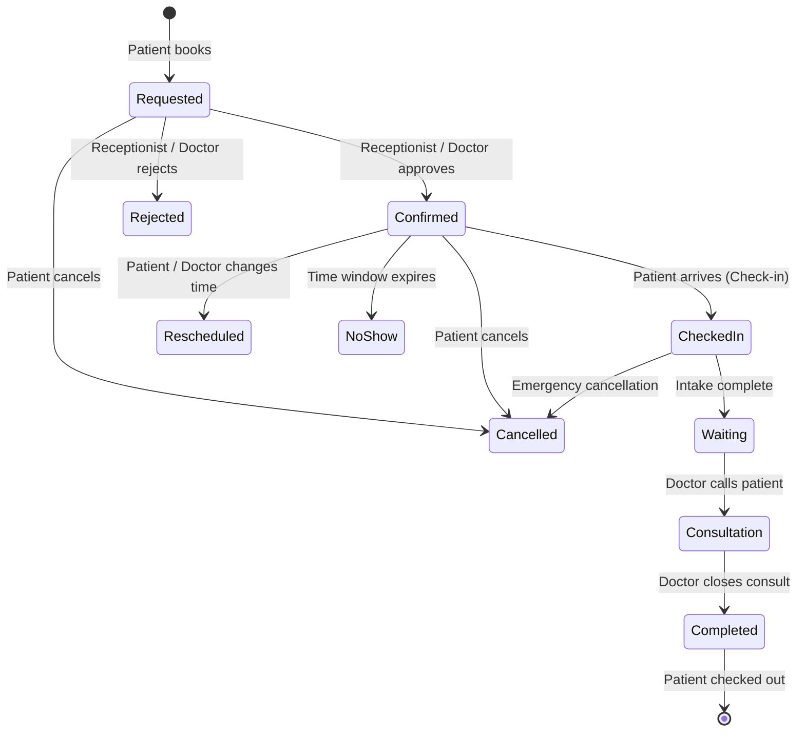
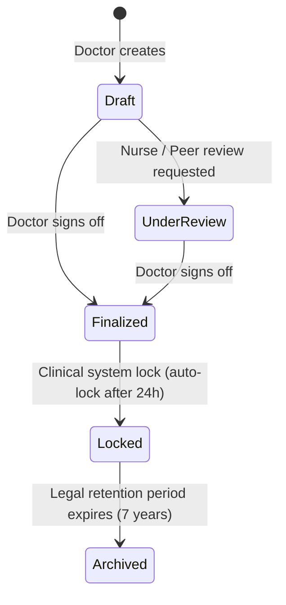
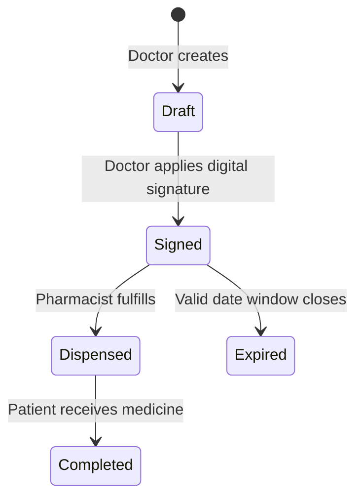
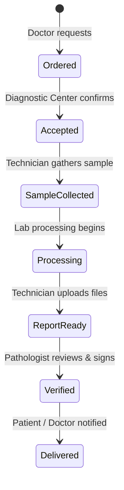
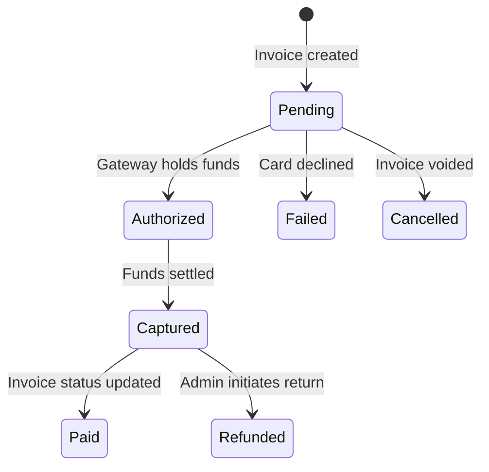

# AyuNet Enterprise Business Architecture & Security Blueprint

This document defines the security models, operational workflows, state machines, auditing rules, and system behavior protocols governing the AyuNet Digital Healthcare Ecosystem.

---

## 1. Platform Roles

AyuNet implements a multi-tenant Role-Based Access Control (RBAC) model. Below is the specification for each application role:

### 1.1. Super Admin
*   **Responsibilities**: Ultimate root control. System bootstrap, global configuration variables, disaster recovery controls, and database maintenance operations.
*   **Scope**: Global platform-wide (unconstrained).
*   **Accessible Modules**: All modules, system settings, global audit logs, network databases.
*   **Restricted Modules**: None.

### 1.2. Platform Admin
*   **Responsibilities**: Manages AyuNet operational systems. Onboards new hospital networks, diagnostic networks, and pharmacy franchises. Manages billing plan models, terms of service, and high-level support ticket escalations.
*   **Scope**: Global operational scope (restricted from viewing clinical patient data).
*   **Accessible Modules**: Onboarding, Billing Configuration, Support, User Management, Global Activity Logs.
*   **Restricted Modules**: EMR (Medical Records, Diagnoses), Prescriptions, Lab Reports (unless specifically requested under legal/support audits).

### 1.3. Hospital Admin
*   **Responsibilities**: Oversees corporate operations for a specific hospital network (e.g., all Apollo locations). Configures network-wide compliance policies, registers branch networks, and supervises billing models.
*   **Scope**: Hospital Network wide.
*   **Accessible Modules**: Branch Management, Employee Registry, Corporate Billing, Operational Metrics.
*   **Restricted Modules**: Direct patient health records (EMR) and prescriptions, unless acting in a clinical capacity (requires dual-role authorization).

### 1.4. Branch Admin
*   **Responsibilities**: Day-to-day management of a single hospital branch location. Onboards local clinical staff, configures facility departments, schedules, rooms, and beds.
*   **Scope**: Assigned Hospital Branch only.
*   **Accessible Modules**: Staff Scheduling, Department Setup, Local Invoices, Local Audit Logs, Reception Queue.
*   **Restricted Modules**: Cross-branch personnel files, corporate billing configurations, global platform settings.

### 1.5. Receptionist
*   **Responsibilities**: Operates patient intake check-ins, registers incoming patients, coordinates doctor scheduling slots, generates local invoicing, and collects co-pays.
*   **Scope**: Assigned Hospital Branch only.
*   **Accessible Modules**: Appointments Booking, TimeSlots View, Patient Registration, Invoices & Payments.
*   **Restricted Modules**: Clinical details (symptoms, EMR diagnoses, medical records, prescription details, lab reports findings).

### 1.6. Doctor
*   **Responsibilities**: Provides medical consultations, manages availability templates, generates medical records, tags ICD-10 diagnoses, authorizes prescriptions, and requests lab tests.
*   **Scope**: Practitioner-patient relationship boundaries (clinical scope).
*   **Accessible Modules**: Doctor Schedules, Appointments, EMR, Prescriptions, Lab Orders.
*   **Restricted Modules**: Facility inventory management, corporate invoicing, security configuration, other doctors' patient records (unless utilizing break-the-glass protocols).

### 1.7. Patient
*   **Responsibilities**: Self-service appointment bookings, profile details updates, viewing personal medical history, paying invoices, and ordering pharmacy prescriptions.
*   **Scope**: Personal profile boundaries only.
*   **Accessible Modules**: Personal EMR, Active Prescriptions, Lab Reports, Appointments Booking, Invoices & Payments.
*   **Restricted Modules**: All clinical and administrative systems of other users.

### 1.8. Caregiver
*   **Responsibilities**: Manages healthcare, scheduling, and billing for one or more delegated patients (e.g. child, elderly relative).
*   **Scope**: Scope delegated explicitly by patients or legal guardians.
*   **Accessible Modules**: Linked Patient Profiles, Delegated EMR, Active Prescriptions, Appointments Booking, Invoices.
*   **Restricted Modules**: Admin settings, unlinked patient records.

### 1.9. Pharmacist
*   **Responsibilities**: Verifies prescription signatures, dispenses medications, updates pharmacy stock records, and fulfills pharmacy delivery orders.
*   **Scope**: Pharmacy facility boundaries.
*   **Accessible Modules**: Prescriptions Lookup, Pharmacy Orders, Inventory.
*   **Restricted Modules**: Complete EMR history, diagnosis history (other than what is explicitly printed on the prescription), diagnostics ordering.

### 1.10. Lab Technician
*   **Responsibilities**: Processes lab and imaging orders, collects biological samples, uploads diagnostic/radiological report attachments, and writes results summaries.
*   **Scope**: Diagnostic Center boundaries.
*   **Accessible Modules**: Lab Orders Queue, Lab Report Upload, Test Catalog.
*   **Restricted Modules**: Complete EMR clinical notes, prescriptions, billing management.

### 1.11. Finance Officer
*   **Responsibilities**: Processes invoice collections, validates insurance claims, manages refunds, and ledger audits.
*   **Scope**: Hospital Network or assigned Branch scope.
*   **Accessible Modules**: Invoices, Payments, Refund Approvals, Transaction Ledgers.
*   **Restricted Modules**: Clinical details (EMR, diagnostic images).

### 1.12. Support Executive
*   **Responsibilities**: Triages user issues, assists in account recovery, and resets notification preferences.
*   **Scope**: Platform customer support scope.
*   **Accessible Modules**: Support Tickets, User Identity Recovery, System Status.
*   **Restricted Modules**: PHI data (EMR, Prescriptions, Lab Reports), financial transaction credentials.

---

## 2. Permission Catalog

Permissions are structured using the `<module>:<action>` naming standard:

### 2.1. Identity & Profile Modules (`identity`)
*   `users:create`: Onboard new platform accounts.
*   `users:read`: Search and view basic account registration details.
*   `users:update`: Modify user account configurations.
*   `users:delete`: Terminate/disable user accounts.
*   `profiles:update`: Update personal user profiles (names, photo, phone, timezone).
*   `roles:assign`: Assign access roles (RBAC) to users.
*   `roles:revoke`: Revoke roles from users.

### 2.2. Clinical Operations Module (`clinical`)
*   `visits:create`: Check in a patient, initializing a clinical visit encounter.
*   `visits:read`: View visit encounter histories.
*   `visits:update`: Modify visit metrics or check-out times.
*   `medical_records:create`: Write EMR clinical notes.
*   `medical_records:read`: Read EMR notes and clinical files.
*   `medical_records:update`: Edit draft medical record entries.
*   `medical_records:lock`: Lock medical records to prevent modifications.
*   `medical_records:archive`: Archive locked medical records for storage compliance.

### 2.3. Prescription Module (`prescriptions`)
*   `prescriptions:create`: Draft medicine prescriptions.
*   `prescriptions:read`: View prescription items and instructions.
*   `prescriptions:sign`: Digitally sign a prescription, validating it.
*   `prescriptions:dispense`: Mark prescription line items as fulfilled/dispensed.

### 2.4. Appointments & Scheduling Module (`scheduling`)
*   `schedules:write`: Create recurring availability templates.
*   `schedules:read`: Read doctor availability schedules.
*   `appointments:create`: Book an appointment.
*   `appointments:read`: View appointment details and calendars.
*   `appointments:update`: Reschedule or modify appointments.
*   `appointments:cancel`: Cancel a booked appointment.
*   `appointments:checkin`: Check in a patient for an appointment.
*   `appointments:complete`: Finalize an appointment consultation.

### 2.5. Diagnostics Module (`diagnostics`)
*   `lab_orders:create`: Place an order for lab/imaging tests.
*   `lab_orders:read`: View diagnostic orders status.
*   `lab_orders:update`: Update order states (e.g. sample collected).
*   `lab_reports:upload`: Upload result files and write summaries.
*   `lab_reports:verify`: Verify and sign off on lab reports.

### 2.6. Pharmacy Module (`pharmacy`)
*   `pharmacy_orders:create`: Place medication purchase orders.
*   `pharmacy_orders:read`: View fulfillment status of pharmacy orders.
*   `pharmacy_orders:update`: Update dispatch/delivery logistics states.

### 2.7. Billing & Finance Module (`finance`)
*   `invoices:create`: Generate billing statements.
*   `invoices:read`: View invoices.
*   `invoices:update`: Edit draft invoices.
*   `payments:create`: Process charge payments.
*   `payments:read`: View payment records.
*   `payments:refund`: Authorize financial refunds.
*   `transactions:read`: Audit financial double-entry ledgers.

### 2.8. Files Module (`files`)
*   `attachments:upload`: Upload clinical/personal files to storage.
*   `attachments:read`: Read file streams.
*   `attachments:delete`: Delete attachments metadata and assets.
*   `documents:verify`: Approve/Reject credential files (e.g. doctor licenses).

### 2.9. Settings & Audit Modules (`admin`)
*   `audit_logs:read`: Access compliance auditing records.
*   `activity_logs:read`: View system activity streams.
*   `settings:update`: Modify system settings.

---

## 3. Role Permission Matrix

The following matrix maps access control rules. Roles are granted explicit permissions.

*   🟢 = Allowed
*   🔴 = Denied
*   🟡 = Conditional (Notes detail scope boundaries)

| Permission | Super Admin | Platform Admin | Hospital Admin | Branch Admin | Receptionist | Doctor | Patient | Caregiver | Pharmacist | Lab Tech | Finance Officer |
| :--- | :---: | :---: | :---: | :---: | :---: | :---: | :---: | :---: | :---: | :---: | :---: |
| `users:create` | 🟢 | 🟢 | 🟡 (1) | 🟡 (1) | 🔴 | 🔴 | 🔴 | 🔴 | 🔴 | 🔴 | 🔴 |
| `users:delete` | 🟢 | 🟢 | 🔴 | 🔴 | 🔴 | 🔴 | 🔴 | 🔴 | 🔴 | 🔴 | 🔴 |
| `roles:assign` | 🟢 | 🟢 | 🟡 (2) | 🟡 (2) | 🔴 | 🔴 | 🔴 | 🔴 | 🔴 | 🔴 | 🔴 |
| `visits:create` | 🔴 | 🔴 | 🔴 | 🟢 | 🟢 | 🟢 | 🔴 | 🔴 | 🔴 | 🔴 | 🔴 |
| `medical_records:create` | 🔴 | 🔴 | 🔴 | 🔴 | 🔴 | 🟢 | 🔴 | 🔴 | 🔴 | 🔴 | 🔴 |
| `medical_records:read` | 🔴 | 🔴 | 🔴 | 🔴 | 🔴 | 🟡 (3) | 🟡 (4) | 🟡 (5) | 🔴 | 🔴 | 🔴 |
| `medical_records:lock` | 🔴 | 🔴 | 🔴 | 🔴 | 🔴 | 🟡 (6) | 🔴 | 🔴 | 🔴 | 🔴 | 🔴 |
| `prescriptions:sign` | 🔴 | 🔴 | 🔴 | 🔴 | 🔴 | 🟡 (7) | 🔴 | 🔴 | 🔴 | 🔴 | 🔴 |
| `prescriptions:dispense` | 🔴 | 🔴 | 🔴 | 🔴 | 🔴 | 🔴 | 🔴 | 🔴 | 🟢 | 🔴 | 🔴 |
| `appointments:create` | 🔴 | 🔴 | 🔴 | 🟢 | 🟢 | 🟢 | 🟢 | 🟡 (5) | 🔴 | 🔴 | 🔴 |
| `appointments:cancel` | 🟢 | 🟢 | 🟢 | 🟢 | 🟢 | 🟢 | 🟡 (4) | 🟡 (5) | 🔴 | 🔴 | 🔴 |
| `lab_reports:upload` | 🔴 | 🔴 | 🔴 | 🔴 | 🔴 | 🔴 | 🔴 | 🔴 | 🔴 | 🟢 | 🔴 |
| `lab_reports:verify` | 🔴 | 🔴 | 🔴 | 🔴 | 🔴 | 🟡 (3) | 🔴 | 🔴 | 🔴 | 🟡 (8) | 🔴 |
| `payments:refund` | 🟢 | 🟢 | 🟢 | 🟡 (9) | 🔴 | 🔴 | 🔴 | 🔴 | 🔴 | 🔴 | 🟢 |
| `audit_logs:read` | 🟢 | 🟢 | 🟡 (10)| 🟡 (11)| 🔴 | 🔴 | 🔴 | 🔴 | 🔴 | 🔴 | 🔴 |
| `settings:update` | 🟢 | 🟢 | 🔴 | 🔴 | 🔴 | 🔴 | 🔴 | 🔴 | 🔴 | 🔴 | 🔴 |

### Conditional Logic Notes:
1.  **Users Creation Scope**: Hospital/Branch Admin can only onboard employees (Doctors, Receptionists, Techs) within their network/branch.
2.  **Role Assignment Scope**: Limited to assigning roles lower than their own administrative tier within their tenant boundaries.
3.  **Doctor EMR Access**: Authorized only if the patient has booked an active appointment with the doctor, is admitted to their branch department, or in cases of emergencies using registered "Break-the-Glass" audit declarations.
4.  **Patient Data Boundary**: Restricted exclusively to their own records.
5.  **Caregiver Scope**: Access is limited to records of patients who have active, verified delegations registered in `patient_caregivers`.
6.  **EMR Lock Restrictions**: Only the authoring doctor can lock a record.
7.  **Prescription Signing**: Requires a valid, active medical license uploaded and verified in `documents`.
8.  **Lab Report Verification**: Limited to designated Pathologists/Radiologists.
9.  **Branch Refund Limits**: Branch Admin can issue refunds up to a system-defined branch limit (e.g. $500). Higher refunds require a Finance Officer or Hospital Admin.
10. **Hospital Admin Audit Logs**: Access to logs restricted to events within their specific hospital network.
11. **Branch Admin Audit Logs**: Access to logs restricted to events within their assigned branch.

---

## 4. Appointment Workflow

The appointment lifecycle operates as a state machine. State changes must follow these path configurations:

### 4.1. State Transitions & Rules

#### 4.1.1. transition: `Requested` ➔ `Confirmed`
*   **Authorized Actors**: Receptionists, Branch Admins, assigned Doctors.
*   **Required Validations**:
    1. Verify `time_slot_id` is still marked `is_reserved = FALSE`.
    2. Confirm Doctor has no other confirmed appointments at the same time.
*   **System Actions**: Set `time_slots.is_reserved = TRUE`.
*   **Notifications Triggered**: Email & SMS sent to Patient. Push notification to Caregiver.
*   **Audit Logs**: Action = `APPOINTMENT_CONFIRMED`, Targets: `AppointmentID`.

#### 4.1.2. transition: `Confirmed` ➔ `CheckedIn`
*   **Authorized Actors**: Receptionists, Branch Admins.
*   **Required Validations**:
    1. Visit must be occurring on the scheduled date.
    2. Patient identity verified (requires receptionist ID check signoff flag).
*   **System Actions**: Create a new row in `visits`, referencing the `appointment_id`.
*   **Notifications Triggered**: In-app push notification to Doctor ("Patient has arrived").
*   **Audit Logs**: Action = `PATIENT_CHECKED_IN`, Targets: `VisitID`, `AppointmentID`.

#### 4.1.3. transition: `CheckedIn` ➔ `Waiting`
*   **Authorized Actors**: Receptionists, Nurses.
*   **Required Validations**: Primary intake metrics (Vitals: BP, Pulse, Temperature) have been recorded.
*   **System Actions**: Update appointment status in receptionist queue dashboard.
*   **Notifications**: None.
*   **Audit Logs**: Action = `APPOINTMENT_WAITING`.

#### 4.1.4. transition: `CheckedIn/Waiting` ➔ `Consultation`
*   **Authorized Actors**: Assigned Doctors.
*   **Required Validations**: Visited branch must match Doctor's active login location.
*   **System Actions**: Lock the associated `time_slot_id` to prevent any modifications.
*   **Notifications**: Push alert sent to Patient's app / screen display in clinic lobby.
*   **Audit Logs**: Action = `CONSULTATION_STARTED`.

#### 4.1.5. transition: `Consultation` ➔ `Completed`
*   **Authorized Actors**: Assigned Doctors.
*   **Required Validations**:
    1. Medical Record entry has been drafted and locked.
    2. If prescription was written, it must be digitally signed.
*   **System Actions**: Update `visits.check_out_at = NOW()`. Release slot lock.
*   **Notifications**: Invoice summary email sent to Patient. Push notification to Caregiver.
*   **Audit Logs**: Action = `APPOINTMENT_COMPLETED`.

#### 4.1.6. transition: Any State ➔ `Cancelled`
*   **Authorized Actors**: Patients (only if > 24 hours before start), Receptionists, Doctors, Admins (anytime).
*   **Required Validations**: Cancel reason text is entered.
*   **System Actions**: Set `time_slots.is_reserved = FALSE`.
*   **Notifications**: Notification sent to Doctor and Patient.
*   **Audit Logs**: Action = `APPOINTMENT_CANCELLED`, record cancel reason.

---

## 5. Medical Record Workflow

EMR notes have a strict compliance lifecycle to meet legal requirements for medical records:

### 5.1. Operations Details

*   **Draft State**:
    *   *Editable by*: The authoring Doctor only.
    *   *Readable by*: The authoring Doctor.
    *   *System Actions*: Auto-save drafts with standard revision numbers.
*   **Under Review State**:
    *   *Editable by*: Authoring Doctor.
    *   *Readable by*: Reviewing Doctor / Nurse.
    *   *Lock Rules*: Cannot be locked until the review status is flagged as resolved.
*   **Finalized State**:
    *   *Editable by*: None (Read-only).
    *   *Readable by*: Patient, Doctor, delegated Caregivers, and medical auditors.
    *   *System Actions*: Generates a hash representing the EMR notes to detect tampering.
*   **Locked State**:
    *   *System Actions*: The system automatically locks EMR files 24 hours after finalization.
    *   *Modifications*: No modifications are allowed. Corrections must be added as separate signed clinical addendums.
*   **Archived State**:
    *   *Trigger*: System cron job 7 years after the record lock date.
    *   *System Actions*: Moves record metadata to cold storage. Restricts normal clinician searches; access requires an administrative request process.

---

## 6. Prescription Workflow

### 6.1. Workflow Rules

*   **Who Can Sign**: Registered Doctors with verified licenses. The system requires token-based PIN verification before signing.
*   **Who Can Edit**: Only the authoring Doctor, and only when the prescription is in the `Draft` state.
*   **Who Can Dispense**: Registered Pharmacists. They must verify the digital signature status first.
*   **Expiry Rules**:
    *   Standard prescriptions expire 180 days after signing.
    *   Controlled substances (e.g. narcotics) expire 30 days after signing and cannot be refilled.
    *   An automated cron job marks expired records daily.

---

## 7. Lab Workflow

### 7.1. Responsibilities by Role

*   **Doctor**:
    *   Initiates the workflow by creating a `LabOrder`.
    *   Receives notifications once reports are `Verified` and reviews results.
*   **Lab Technician**:
    *   Accepts the order, schedules sample collections, and tracks sample barcodes.
    *   Processes specimens and updates status to `Processing`.
    *   Uploads reports and results, changing status to `ReportReady`.
*   **Pathologist / Chief Lab Tech**:
    *   Reviews findings for quality control.
    *   Applies a digital verification signature, changing the status to `Verified`.
*   **Patient**:
    *   Receives alerts when reports are ready and can access PDFs online.

---

## 8. Payment Workflow

### 8.1. Operations Details

*   **Gateway Integrations**:
    *   Supports Stripe, Razorpay, or local gateways via webhook handlers.
    *   Holds funds in `Authorized` status during patient check-in. Settlements are `Captured` when the consultation begins.
*   **Manual Refund Rules**:
    *   In-clinic receptionist check-in cancellations can be refunded instantly by Branch Admins.
    *   System refund disputes require Finance Officer validation and approval before processing.
*   **Refund Policy**:
    *   Cancellations made > 24 hours before the appointment receive a 100% refund.
    *   Cancellations made < 24 hours before the appointment are subject to a fee.
    *   No-shows are non-refundable unless approved by administrative exception.

---

## 9. Notification Matrix

AyuNet sends transactional notifications across several channels:

| Event Name | Primary Recipient | Channel | Priority | Retry Policy | Description |
| :--- | :--- | :--- | :---: | :--- | :--- |
| `OTP_GENERATED` | User | SMS / Email | Critical | Max 3 retries (5s interval) | MFA and login codes. |
| `PASSWORD_RESET` | User | Email | Critical | Max 2 retries (10s interval)| Security credential changes. |
| `APPOINTMENT_BOOKED`| Patient, Doctor | Email, Push | Medium | Max 3 retries (Exponential) | Booking confirmation. |
| `APPOINTMENT_CANCEL`| Patient, Doctor | SMS, Push | High | Max 5 retries (Exponential) | Cancellations or schedule changes. |
| `PRESCRIPTION_SIGN` | Patient, Caregiver | Push, Email | High | Max 3 retries (Exponential) | Notification when a prescription is ready. |
| `LAB_REPORT_READY` | Patient, Doctor | Push, SMS | High | Max 3 retries (Exponential) | Notification when diagnostic results are verified. |
| `PAYMENT_SUCCESS` | Patient | Email | Medium | Max 5 retries (Exponential) | Receipt delivery. |
| `CRITICAL_ALERT` | Caregiver, Doctor | Push, SMS | Critical | Infinite retry until ACK | Patient telemetry warnings. |

---

## 10. Audit Policy

Compliance auditing logs record all sensitive actions. Auditing records must be **write-once** and kept for a minimum of 7 years.

| Event Type | Actor ID | Entity Tracked | Captures State Diff? | Purpose |
| :--- | :---: | :--- | :---: | :--- |
| `USER_LOGIN` | Yes | `Session` | No | Security access monitoring. |
| `USER_LOGOUT` | Yes | `Session` | No | Session end tracking. |
| `EMR_VIEW` | Yes | `MedicalRecord` | No | Patient confidentiality tracking (HIPAA). |
| `EMR_EDIT` | Yes | `MedicalRecord` | Yes | Track modifications to health records. |
| `PRESCRIPTION_SIGN`| Yes | `Prescription` | Yes | Prescriptions and licensing sign-offs. |
| `LAB_REPORT_UPLOAD`| Yes | `LabReport` | No | Diagnostic file changes. |
| `ROLE_MODIFIED` | Yes | `UserRole` | Yes | RBAC adjustments. |
| `PAYMENT_REFUNDED` | Yes | `Payment` | Yes | Financial adjustments. |
| `BREAK_THE_GLASS` | Yes | `MedicalRecord` | No | Emergency clinical access override log. |

---

## 11. File Access Policy

Access to stored attachments is controlled based on role hierarchies and clinical relationships:

| File Type | Primary Owner | Readers | Editors | Deletion Rule | Retention Policy |
| :--- | :--- | :--- | :--- | :--- | :--- |
| **Medical Records** | Patient | Patient, Doctor, Caregiver | Authoring Doctor | Prohibited | 7 Years (Clinical data) |
| **Lab Reports** | Patient | Patient, Doctor, Lab Tech | Lab Tech | Prohibited | 7 Years (Clinical data) |
| **Prescriptions** | Patient | Patient, Doctor, Pharmacist | Authoring Doctor | Prohibited | 7 Years (Clinical data) |
| **Invoices / Receipts** | Patient | Patient, Finance, Receptionist | Finance Officer | Prohibited | 10 Years (Tax audits) |
| **Doctor Licenses** | Doctor | Platform Admin, Hospital Admin | Doctor | Admin Only | Retained while active |
| **Identity Verification**| User | Platform Admin | User | Admin Only | 5 Years after deletion |

---

## 12. Business Validation Rules

To protect patient safety and optimize clinic workflows, the system enforces several validation rules:

### 12.1. Overlapping Bookings
*   **Rule**: A Patient cannot book overlapping appointments.
*   **Logic**: An insert on `appointments` fails if `scheduled_start_at` falls between any of the patient's existing appointments.

### 12.2. Overlapping Schedules
*   **Rule**: A Doctor cannot have overlapping availability schedules.
*   **Logic**: Inserts on `doctor_schedules` fail if a new time block overlaps with an existing schedule for the same doctor and branch on that day of the week.

### 12.3. Prescription Signatures
*   **Rule**: Only licensed doctors can issue prescriptions.
*   **Logic**: Digital signature authorization fails if `doctors.license_number` is missing or if the doctor's status is not set to verified.

### 12.4. Lab Orders
*   **Rule**: Lab report files cannot be uploaded before a sample is collected.
*   **Logic**: File uploads on `lab_reports` return an error if the parent `lab_orders.status` is not set to `SampleCollected` or `Processing`.

### 12.5. Invoice Modifications
*   **Rule**: Invoices cannot be modified after payment.
*   **Logic**: Any updates to invoice line items will fail if the invoice status is set to `PAID`.

### 12.6. Cancelled Appointments
*   **Rule**: Cancelled appointments cannot generate prescriptions.
*   **Logic**: Creating a prescription fails if the associated appointment status is set to `CANCELLED`.

### 12.7. Visit Deletions
*   **Rule**: Completed clinical encounters cannot be deleted.
*   **Logic**: The system blocks delete operations on any `visits` record where `check_out_at` has been set.

---

## 13. Security Policies

### 13.1. Passwords
*   Minimum 12 characters, including uppercase, lowercase, numbers, and special characters.
*   Retains password history (cannot reuse last 5 passwords).
*   Mandatory password resets every 90 days for administrators and clinicians.

### 13.2. One-Time Passwords (OTPs)
*   6-digit numeric codes generated using cryptographically secure random number generators (CSPRNG).
*   Valid for 5 minutes. Max 3 verification attempts before invalidation.
*   Rate-limits generation requests (max 1 OTP request per minute per phone/email).

### 13.3. Sessions
*   Automatically terminates sessions after 15 minutes of idle time for clinicians, and 30 minutes for patients.
*   Limits concurrent sessions (administrators are restricted to 1 active session at a time).
*   Enables remote session termination (users can terminate sessions on other devices).

### 13.4. JWT Tokens
*   **Access Token**: 15 minutes validity, signed using RS256 private keys.
*   **Refresh Token**: 7 days validity, stored as a SHA-256 hash in the database.
*   **Refresh Token Rotation (RTR)**: When a refresh token is used, it is invalidated and replaced. If an invalidated token is reused, the system automatically terminates all active sessions associated with that user to prevent unauthorized access.

### 13.5. Account Locks
*   Accounts are locked for 15 minutes after 5 consecutive failed login attempts.
*   Subsequent lockouts double the lock duration (30 mins, 60 mins).
*   Sends notification alerts to the user's registered email when locks occur.

### 13.6. Rate Limiting
*   Public API endpoints: Max 60 requests per minute per IP address.
*   Auth endpoints (Login, Reset Password): Max 5 requests per minute per IP address.
*   Authorized API endpoints: Max 300 requests per minute per authenticated user.

### 13.7. Device Verification
*   Validates device characteristics using browser fingerprinting.
*   Requires email verification code approval when users log in from a new device.

---

## 14. Future Expansion Strategy

AyuNet's workflows are designed to support upcoming integrations:

### 14.1. Insurance Operations
*   Integrates with clearinghouse APIs to verify patient eligibility in real-time.
*   Submits claims automatically when an appointment reaches `Completed` status.
*   Calculates co-pays dynamically based on the patient's insurance plan.

### 14.2. Video Consultations
*   Uses WebSocket signaling channels to coordinate WebRTC video consults.
*   Creates video rooms on-demand when appointments transition to `Consultation` status.
*   Requires patient consent before starting any audio/video recordings.

### 14.3. AI Assistant Integration
*   Processes text from locked clinical records to generate case summaries.
*   Uses LLM prompt guards to filter advice and ensure the AI assistant does not prescribe medication or override clinician orders.

### 14.4. Wearables Integration
*   Uses IoT endpoints to ingest patient vitals (e.g. heart rate, blood oxygen levels).
*   Triggers notifications to caregivers and doctors when readings exceed predefined safety thresholds.

### 14.5. FHIR Alignment
*   Exposes APIs using standardized HL7 FHIR formats (JSON).
*   Maps clinical models directly to FHIR resources (e.g., EMR notes map to FHIR Clinical Statement).
