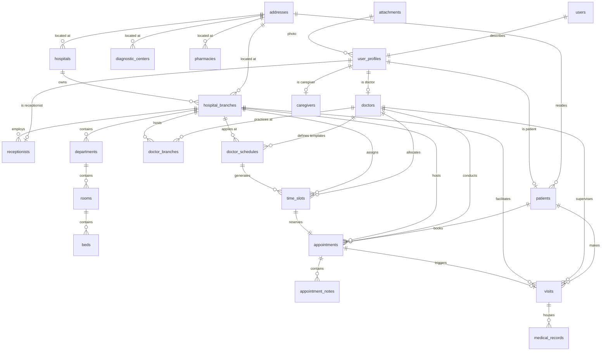

# AyuNet Enterprise Domain Model Design Document

This document outlines the refined enterprise domain model and relational database architecture for AyuNet. This design supports multi-location hospital chains, eliminates profile and address duplication, models availability schedules, and leverages native PostgreSQL enums to maintain strict type safety.

---

## 1. Domain Overview

AyuNet's database architecture is split into **11 domain boundaries**:

1.  **Core Identity & Access Management (IAM)**: Handles credentials, sessions, multi-factor authentication (OTP), and role-based permissions (RBAC).
2.  **User Profiles & Demographics**: Contains personal profiles (`user_profiles`) and addresses (`addresses`) separate from auth credentials.
3.  **Healthcare Providers**: Tracks multi-facility hospital chains (`hospitals`, `hospital_branches`), clinical hierarchy (`departments`, `rooms`, `beds`), and professional credentials (`doctors`, `caregivers`, `receptionists`).
4.  **Scheduling & Availability**: Coordinates doctor availability templates (`doctor_schedules`), generated booking slots (`time_slots`), and patient bookings (`appointments`).
5.  **Electronic Medical Records (EMR)**: Stores clinical encounters (`visits`), EMR notes (`medical_records`), diagnosis codes (`diagnoses`), patient `allergies`, `chronic_conditions`, and `vaccinations`.
6.  **e-Prescriptions**: Authorizes electronic prescriptions (`prescriptions`, `prescription_items`, `medicines`).
7.  **Diagnostics & Labs**: Manages laboratory order workflows (`lab_orders`, `lab_reports`, `lab_tests`, `diagnostic_centers`).
8.  **Pharmacy & Supply Chain**: Coordinates medication orders and deliveries (`pharmacies`, `pharmacy_orders`, `pharmacy_order_items`).
9.  **Document Storage & Metadata**: Tracks object storage files (`attachments`) and formal credentials verify-states (`documents`).
10. **Notifications**: Manages notifications and preferences (`notifications`, `notification_preferences`).
11. **Platform Administration & Finance**: Logs compliance records (`audit_logs`), server settings (`system_settings`), user activities (`activity_logs`), billing headers (`invoices`), payment statuses (`payments`), and cash ledger entries (`transactions`).

---

## 2. PostgreSQL Enums

To ensure data integrity and avoid free-form strings, AyuNet uses PostgreSQL native enums.

```sql
CREATE TYPE enum_gender AS ENUM ('MALE', 'FEMALE', 'OTHER', 'PREFER_NOT_TO_SAY');
CREATE TYPE enum_appointment_status AS ENUM ('PENDING', 'CONFIRMED', 'CANCELLED', 'COMPLETED', 'NOSHOW');
CREATE TYPE enum_visit_type AS ENUM ('OUTPATIENT', 'INPATIENT', 'EMERGENCY', 'TELEVISIT');
CREATE TYPE enum_notification_channel AS ENUM ('IN_APP', 'EMAIL', 'SMS', 'PUSH');
CREATE TYPE enum_payment_status AS ENUM ('PENDING', 'PAID', 'FAILED', 'REFUNDED');
CREATE TYPE enum_payer_type AS ENUM ('PATIENT', 'INSURANCE', 'SPONSOR');
CREATE TYPE enum_invoice_status AS ENUM ('DRAFT', 'SENT', 'PAID', 'OVERDUE', 'VOID');
CREATE TYPE enum_transaction_type AS ENUM ('CHARGE', 'REFUND', 'ADJUSTMENT');
CREATE TYPE enum_document_type AS ENUM ('MED_LICENSE', 'REGISTRATION_CERTIFICATE', 'PATIENT_ID', 'INSURANCE_CARD');
CREATE TYPE enum_document_status AS ENUM ('PENDING_VERIFICATION', 'VERIFIED', 'REJECTED', 'EXPIRED');
CREATE TYPE enum_allergy_type AS ENUM ('DRUG', 'FOOD', 'ENVIRONMENTAL', 'OTHER');
CREATE TYPE enum_allergy_severity AS ENUM ('MILD', 'MODERATE', 'SEVERE', 'LIFE_THREATENING');
CREATE TYPE enum_allergy_status AS ENUM ('ACTIVE', 'INACTIVE', 'RESOLVED');
CREATE TYPE enum_condition_status AS ENUM ('ACTIVE', 'CONTROLLED', 'REMISSION');
CREATE TYPE enum_lab_order_status AS ENUM ('PLACED', 'SAMPLE_COLLECTED', 'PROCESSING', 'COMPLETED', 'CANCELLED');
CREATE TYPE enum_lab_report_status AS ENUM ('PRELIMINARY', 'FINAL', 'AMENDED');
CREATE TYPE enum_pharmacy_order_status AS ENUM ('PENDING', 'CONFIRMED', 'PREPARING', 'DISPATCHED', 'DELIVERED', 'CANCELLED');
CREATE TYPE enum_room_type AS ENUM ('ICU', 'GENERAL_WARD', 'PRIVATE', 'SEMIPRIVATE');
CREATE TYPE enum_bed_status AS ENUM ('AVAILABLE', 'OCCUPIED', 'MAINTENANCE');
```

---

## 3. Entity List

All primary keys (`id`) are `UUIDv4` types unless they are composite keys on join tables.

| Domain | Entity Name | Table Name | Description |
| :--- | :--- | :--- | :--- |
| **Address** | Address | `addresses` | Common table containing physical addresses. |
| **Identity** | User | `users` | Auth credentials, active status, MFA flags. |
| | UserProfile | `user_profiles` | Aggregates name, photo, language, timezone, phone. |
| | Role | `roles` | Access roles (PATIENT, DOCTOR, ADMIN, etc.). |
| | Permission | `permissions` | Granular capability descriptors (e.g. `records:read`). |
| | UserRole | `user_roles` | Link mapping Users to Roles. |
| | RolePermission | `role_permissions` | Link mapping Roles to Permissions. |
| | RefreshToken | `refresh_tokens` | Secure token hashes for JWT extensions. |
| | OTP | `otps` | Security codes for MFA and verifications. |
| | Session | `sessions` | Active user sessions tracking device and IP. |
| **Healthcare** | Patient | `patients` | Patient clinical profile, blood group, emergency contact. |
| | Doctor | `doctors` | Practitioner licensing, fee, and clinical qualifications. |
| | Hospital | `hospitals` | Corporate entity for hospital networks (e.g. Apollo). |
| | HospitalBranch | `hospital_branches` | Specific locations/branches of a hospital network. |
| | Department | `departments` | Specialized clinical wings (e.g. Cardiology) under a branch. |
| | Room | `rooms` | Clinic rooms under clinical departments. |
| | Bed | `beds` | Beds inside rooms. |
| | Receptionist | `receptionists` | Hospital branch receptionist accounts. |
| | Caregiver | `caregivers` | Caregiver profiles (family/professional). |
| | DoctorBranch | `doctor_branches` | Join table connecting Doctors to Hospital Branches. |
| | DoctorSpecialization | `doctor_specializations` | Join table connecting Doctors to Specializations. |
| | Specialization | `specializations` | Catalog of clinical specialties (e.g. Cardiology). |
| | PatientCaregiver | `patient_caregivers` | Join table connecting Patients to Caregivers. |
| **Scheduling** | DoctorSchedule | `doctor_schedules` | Doctor availability templates (Mondays 9-1, etc.). |
| | TimeSlot | `time_slots` | Specific generated availability slots. |
| | Appointment | `appointments` | Bookings between patient, doctor, and hospital branch. |
| | AppointmentNotes | `appointment_notes` | Intake notes and receptionist comments. |
| **EMR** | Visit | `visits` | Clinical encounter records (outpatient, inpatient, etc.). |
| | MedicalRecord | `medical_records` | Detailed clinical notes, symptoms, and treatment plans. |
| | Diagnosis | `diagnoses` | Medical diagnoses codes (ICD-10) for medical records. |
| | Allergy | `allergies` | Patient allergens and severity tracker. |
| | ChronicCondition | `chronic_conditions` | Active long-term patient medical issues. |
| | Vaccination | `vaccinations` | Record of vaccines administered to a patient. |
| | MedicalRecordAttachment | `medical_record_attachments` | Link between EMRs and physical files. |
| **Prescriptions** | Prescription | `prescriptions` | Authorized prescription headers signed by a doctor. |
| | PrescriptionItem | `prescription_items` | Prescription line-item medicines and instructions. |
| | Medicine | `medicines` | Catalog of approved brand and generic medicines. |
| **Diagnostics** | DiagnosticCenter | `diagnostic_centers` | Lab and imaging center partner profiles. |
| | LabTest | `lab_tests` | Catalog of diagnostic tests (LOINC-linked). |
| | CenterLabTest | `center_lab_tests` | Pricing and availability of lab tests per center. |
| | LabOrder | `lab_orders` | Test ordering workflow tracking. |
| | LabOrderTest | `lab_order_tests` | Join table for tests requested in an order. |
| | LabReport | `lab_reports` | Results summaries for laboratory orders. |
| | LabReportAttachment | `lab_report_attachments` | Link between lab reports and physical PDF/image files. |
| **Pharmacy** | Pharmacy | `pharmacies` | Pharmacy store facility profiles. |
| | PharmacyOrder | `pharmacy_orders` | Medicine purchase orders. |
| | PharmacyOrderItem | `pharmacy_order_items` | Individual line-item medicine items in a purchase. |
| **Files** | Attachment | `attachments` | Object storage metadata (S3 key, size, type). |
| | Document | `documents` | Official credentials validation files (licenses, IDs). |
| **Admin & Finance**| Notification | `notifications` | Sent alert/notification logs. |
| | NotificationPreference| `notification_preferences` | User communication preferences per category. |
| | AuditLog | `audit_logs` | Security read/write compliance logs. |
| | ActivityLog | `activity_logs` | Operational system logs. |
| | SystemSetting | `system_settings` | Global system configurations. |
| | Invoice | `invoices` | Detailed customer billing headers. |
| | Payment | `payments` | Gateway transaction tracking. |
| | Transaction | `transactions` | Double-entry financial ledgers. |

---

## 4. Relationship Matrix

AyuNet enforces strict foreign key references and cascade/restrict behaviors to protect patient data integrity:

| Parent Table | Child Table | Relationship | Cardinality | Nullability | On Delete Rule | On Update Rule |
| :--- | :--- | :--- | :--- | :--- | :--- | :--- |
| `addresses` | `patients` | One-to-Many | 1 : N | Required | RESTRICT | CASCADE |
| `addresses` | `hospitals` | One-to-Many | 1 : N | Required | RESTRICT | CASCADE |
| `addresses` | `hospital_branches` | One-to-Many | 1 : N | Required | RESTRICT | CASCADE |
| `addresses` | `diagnostic_centers`| One-to-Many | 1 : N | Required | RESTRICT | CASCADE |
| `addresses` | `pharmacies` | One-to-Many | 1 : N | Required | RESTRICT | CASCADE |
| `users` | `user_profiles` | One-to-One | 1 : 1 | Required | CASCADE | CASCADE |
| `user_profiles` | `patients` | One-to-One | 1 : 1 | Required | RESTRICT | CASCADE |
| `user_profiles` | `doctors` | One-to-One | 1 : 1 | Required | RESTRICT | CASCADE |
| `user_profiles` | `caregivers` | One-to-One | 1 : 1 | Required | RESTRICT | CASCADE |
| `user_profiles` | `receptionists` | One-to-One | 1 : 1 | Required | RESTRICT | CASCADE |
| `attachments` | `user_profiles` | One-to-Many | 1 : N | Optional | SET NULL | CASCADE |
| `users` | `user_roles` | One-to-Many | 1 : N | Required | CASCADE | CASCADE |
| `roles` | `user_roles` | One-to-Many | 1 : N | Required | CASCADE | CASCADE |
| `roles` | `role_permissions` | One-to-Many | 1 : N | Required | CASCADE | CASCADE |
| `permissions`| `role_permissions` | One-to-Many | 1 : N | Required | CASCADE | CASCADE |
| `users` | `refresh_tokens` | One-to-Many | 1 : N | Required | CASCADE | CASCADE |
| `users` | `otps` | One-to-Many | 1 : N | Required | CASCADE | CASCADE |
| `users` | `sessions` | One-to-Many | 1 : N | Required | CASCADE | CASCADE |
| `hospitals` | `hospital_branches` | One-to-Many | 1 : N | Required | CASCADE | CASCADE |
| `hospital_branches`| `departments` | One-to-Many | 1 : N | Required | CASCADE | CASCADE |
| `departments` | `rooms` | One-to-Many | 1 : N | Required | CASCADE | CASCADE |
| `rooms` | `beds` | One-to-Many | 1 : N | Required | CASCADE | CASCADE |
| `hospital_branches`| `receptionists` | One-to-Many | 1 : N | Required | CASCADE | CASCADE |
| `doctors` | `doctor_branches` | One-to-Many | 1 : N | Required | CASCADE | CASCADE |
| `hospital_branches`| `doctor_branches` | One-to-Many | 1 : N | Required | CASCADE | CASCADE |
| `doctors` | `doctor_specializations` | One-to-Many | 1 : N | Required | CASCADE | CASCADE |
| `specializations` | `doctor_specializations`| One-to-Many | 1 : N | Required | CASCADE | CASCADE |
| `patients` | `patient_caregivers` | One-to-Many | 1 : N | Required | CASCADE | CASCADE |
| `caregivers` | `patient_caregivers` | One-to-Many | 1 : N | Required | CASCADE | CASCADE |
| `doctors` | `doctor_schedules` | One-to-Many | 1 : N | Required | CASCADE | CASCADE |
| `hospital_branches`| `doctor_schedules` | One-to-Many | 1 : N | Required | CASCADE | CASCADE |
| `doctors` | `time_slots` | One-to-Many | 1 : N | Required | CASCADE | CASCADE |
| `hospital_branches`| `time_slots` | One-to-Many | 1 : N | Required | CASCADE | CASCADE |
| `doctor_schedules`| `time_slots` | One-to-Many | 1 : N | Optional | SET NULL | CASCADE |
| `patients` | `appointments` | One-to-Many | 1 : N | Required | RESTRICT | CASCADE |
| `doctors` | `appointments` | One-to-Many | 1 : N | Required | RESTRICT | CASCADE |
| `hospital_branches`| `appointments` | One-to-Many | 1 : N | Required | RESTRICT | CASCADE |
| `time_slots` | `appointments` | One-to-One | 1 : 1 | Required | RESTRICT | CASCADE |
| `appointments`| `appointment_notes` | One-to-Many | 1 : N | Required | CASCADE | CASCADE |
| `patients` | `visits` | One-to-Many | 1 : N | Required | RESTRICT | CASCADE |
| `doctors` | `visits` | One-to-Many | 1 : N | Required | RESTRICT | CASCADE |
| `hospital_branches`| `visits` | One-to-Many | 1 : N | Required | RESTRICT | CASCADE |
| `appointments`| `visits` | One-to-One | 1 : 1 | Optional | SET NULL | CASCADE |
| `visits` | `medical_records` | One-to-Many | 1 : N | Optional | RESTRICT | CASCADE |
| `patients` | `medical_records` | One-to-Many | 1 : N | Required | RESTRICT | CASCADE |
| `doctors` | `medical_records` | One-to-Many | 1 : N | Required | RESTRICT | CASCADE |
| `medical_records` | `diagnoses` | One-to-Many | 1 : N | Required | CASCADE | CASCADE |
| `patients` | `allergies` | One-to-Many | 1 : N | Required | CASCADE | CASCADE |
| `patients` | `chronic_conditions` | One-to-Many | 1 : N | Required | CASCADE | CASCADE |
| `patients` | `vaccinations` | One-to-Many | 1 : N | Required | CASCADE | CASCADE |
| `medical_records` | `prescriptions` | One-to-Many | 1 : N | Required | RESTRICT | CASCADE |
| `prescriptions` | `prescription_items` | One-to-Many | 1 : N | Required | CASCADE | CASCADE |
| `medicines` | `prescription_items` | One-to-Many | 1 : N | Required | RESTRICT | CASCADE |
| `diagnostic_centers` | `lab_orders` | One-to-Many | 1 : N | Required | RESTRICT | CASCADE |
| `patients` | `lab_orders` | One-to-Many | 1 : N | Required | RESTRICT | CASCADE |
| `doctors` | `lab_orders` | One-to-Many | 1 : N | Optional | SET NULL | CASCADE |
| `lab_orders` | `lab_reports` | One-to-Many | 1 : N | Required | CASCADE | CASCADE |
| `patients` | `pharmacy_orders` | One-to-Many | 1 : N | Required | RESTRICT | CASCADE |
| `pharmacies` | `pharmacy_orders` | One-to-Many | 1 : N | Required | RESTRICT | CASCADE |
| `prescriptions` | `pharmacy_orders` | One-to-Many | 1 : N | Optional | SET NULL | CASCADE |
| `pharmacy_orders` | `pharmacy_order_items`| One-to-Many | 1 : N | Required | CASCADE | CASCADE |
| `medicines` | `pharmacy_order_items`| One-to-Many | 1 : N | Required | RESTRICT | CASCADE |
| `attachments`| `documents` | One-to-One | 1 : 1 | Required | RESTRICT | CASCADE |
| `users` | `documents` | One-to-Many | 1 : N | Required | RESTRICT | CASCADE |
| `users` | `notifications` | One-to-Many | 1 : N | Required | CASCADE | CASCADE |
| `users` | `notification_preferences`| One-to-Many | 1 : N | Required | CASCADE | CASCADE |
| `users` | `audit_logs` | One-to-Many | 1 : N | Optional | SET NULL | CASCADE |
| `users` | `activity_logs` | One-to-Many | 1 : N | Optional | SET NULL | CASCADE |
| `patients` | `invoices` | One-to-Many | 1 : N | Required | RESTRICT | CASCADE |
| `invoices` | `payments` | One-to-Many | 1 : N | Required | RESTRICT | CASCADE |
| `invoices` | `transactions` | One-to-Many | 1 : N | Required | RESTRICT | CASCADE |
| `payments` | `transactions` | One-to-Many | 1 : N | Optional | SET NULL | CASCADE |

---

## 4. Entity Descriptions

### 4.1. Address & Profiles Domain

#### 4.1.1. Address (`addresses`)
*   **Purpose**: Centralizes physical addresses for patients, pharmacies, hospitals, and diagnostic labs to support standardization and geolocation.
*   **Attributes**:
    *   `id`: `UUID` (NOT NULL, Default: `gen_random_uuid()`)
    *   `address_line1`: `VARCHAR(255)` (NOT NULL)
    *   `address_line2`: `VARCHAR(255)` (NULL)
    *   `city`: `VARCHAR(100)` (NOT NULL)
    *   `state`: `VARCHAR(100)` (NOT NULL)
    *   `postal_code`: `VARCHAR(20)` (NOT NULL)
    *   `country`: `VARCHAR(100)` (NOT NULL)
    *   `latitude`: `DECIMAL(9, 6)` (NULL) (e.g. `17.448293`)
    *   `longitude`: `DECIMAL(9, 6)` (NULL) (e.g. `78.374185`)
    *   *Shared Base Fields*: `created_at`, `updated_at`, `deleted_at`, `created_by`, `updated_by`, `deleted_by`
*   **Primary Key**: `pk_addresses` (`id`)
*   **Foreign Keys**: None
*   **Index Recommendations**:
    *   `idx_addresses_city_state` -> `(city, state)`
    *   `idx_addresses_coords` -> `(latitude, longitude)` WHERE latitude IS NOT NULL
*   **Soft Delete Requirement**: Yes. Addresses shouldn't be hard-deleted if they link to historical profiles.
*   **Audit Fields**: Yes.

#### 5.1.2. UserProfile (`user_profiles`)
*   **Purpose**: Lightweight container for shared personal data, separating auth details from display profile.
*   **Attributes**:
    *   `id`: `UUID` (NOT NULL, Default: `gen_random_uuid()`)
    *   `user_id`: `UUID` (NOT NULL)
    *   `first_name`: `VARCHAR(100)` (NOT NULL)
    *   `last_name`: `VARCHAR(100)` (NOT NULL)
    *   `profile_photo_id`: `UUID` (NULL) (References `attachments.id`)
    *   `phone`: `VARCHAR(50)` (NULL) (For communication/contacts)
    *   `preferred_language`: `VARCHAR(10)` (NOT NULL, Default: `'en'`)
    *   `timezone`: `VARCHAR(100)` (NOT NULL, Default: `'UTC'`)
    *   *Shared Base Fields*: `created_at`, `updated_at`, `deleted_at`, `created_by`, `updated_by`, `deleted_by`
*   **Primary Key**: `pk_user_profiles` (`id`)
*   **Foreign Keys**:
    *   `fk_user_profiles_users_user_id` -> `users(id)` ON DELETE CASCADE
    *   `fk_user_profiles_attachments_photo_id` -> `attachments(id)` ON DELETE SET NULL
*   **Unique Constraints**:
    *   `uq_user_profiles_user_id` on `user_id` (Filtered index: `WHERE deleted_at IS NULL`)
*   **Index Recommendations**:
    *   `idx_user_profiles_user_id` -> `(user_id)` WHERE deleted_at IS NULL
    *   `idx_user_profiles_names` -> `(last_name, first_name)`
*   **Soft Delete Requirement**: Yes.
*   **Audit Fields**: Yes.

---

### 5.2. Core Identity Domain

#### 5.2.1. User (`users`)
*   **Purpose**: Auth credentials, multi-factor verification configurations, and system-level flags.
*   **Attributes**:
    *   `id`: `UUID` (NOT NULL, Default: `gen_random_uuid()`)
    *   `email`: `VARCHAR(255)` (NOT NULL)
    *   `phone_number`: `VARCHAR(50)` (NULL) (Used specifically for auth/OTP)
    *   `password_hash`: `VARCHAR(255)` (NOT NULL)
    *   `is_active`: `BOOLEAN` (NOT NULL, Default: `TRUE`)
    *   `email_verified`: `BOOLEAN` (NOT NULL, Default: `FALSE`)
    *   `phone_verified`: `BOOLEAN` (NOT NULL, Default: `FALSE`)
    *   `two_factor_enabled`: `BOOLEAN` (NOT NULL, Default: `FALSE`)
    *   `last_login_at`: `TIMESTAMP WITH TIME ZONE` (NULL)
    *   *Shared Base Fields*: `created_at`, `updated_at`, `deleted_at`, `created_by`, `updated_by`, `deleted_by`
*   **Primary Key**: `pk_users` (`id`)
*   **Unique Constraints**:
    *   `uq_users_email` on `email` (Filtered index: `WHERE deleted_at IS NULL`)
    *   `uq_users_phone` on `phone_number` (Filtered index: `WHERE deleted_at IS NULL AND phone_number IS NOT NULL`)
*   **Index Recommendations**:
    *   `idx_users_email_active` -> `(email) WHERE deleted_at IS NULL`
*   **Soft Delete Requirement**: Yes.
*   **Audit Fields**: Yes.

#### 5.2.2. Role (`roles`), Permission (`permissions`), UserRole (`user_roles`), RolePermission (`role_permissions`), RefreshToken (`refresh_tokens`), OTP (`otps`), Session (`sessions`)
*   *(Same design as Phase 1, linking to `users.id`)*.

---

### 5.3. Healthcare Providers Domain

#### 5.3.1. Patient (`patients`)
*   **Purpose**: Clinical demographics linked to patient profile.
*   **Attributes**:
    *   `id`: `UUID` (NOT NULL, Default: `gen_random_uuid()`)
    *   `user_profile_id`: `UUID` (NOT NULL)
    *   `date_of_birth`: `DATE` (NOT NULL)
    *   `gender`: `enum_gender` (NOT NULL)
    *   `blood_group`: `VARCHAR(10)` (NULL)
    *   `address_id`: `UUID` (NOT NULL)
    *   `emergency_contact_name`: `VARCHAR(100)` (NOT NULL)
    *   `emergency_contact_phone`: `VARCHAR(50)` (NOT NULL)
    *   `emergency_contact_relationship`: `VARCHAR(50)` (NOT NULL)
    *   *Shared Base Fields*: `created_at`, `updated_at`, `deleted_at`, `created_by`, `updated_by`, `deleted_by`
*   **Primary Key**: `pk_patients` (`id`)
*   **Foreign Keys**:
    *   `fk_patients_user_profiles_profile_id` -> `user_profiles(id)` ON DELETE RESTRICT
    *   `fk_patients_addresses_address_id` -> `addresses(id)` ON DELETE RESTRICT
*   **Unique Constraints**:
    *   `uq_patients_profile_id` on `user_profile_id` (Filtered index: `WHERE deleted_at IS NULL`)
*   **Index Recommendations**:
    *   `idx_patients_profile_id` -> `(user_profile_id)` WHERE deleted_at IS NULL
    *   `idx_patients_dob` -> `(date_of_birth)`
*   **Soft Delete Requirement**: Yes.
*   **Audit Fields**: Yes.

#### 5.3.2. Doctor (`doctors`)
*   **Purpose**: Clinical details and credentials representing an individual doctor profile.
*   **Attributes**:
    *   `id`: `UUID` (NOT NULL, Default: `gen_random_uuid()`)
    *   `user_profile_id`: `UUID` (NOT NULL)
    *   `license_number`: `VARCHAR(100)` (NOT NULL)
    *   `qualification`: `TEXT` (NOT NULL)
    *   `experience_years`: `INTEGER` (NOT NULL, Default: `0`)
    *   `consultation_fee`: `DECIMAL(10, 2)` (NOT NULL)
    *   `bio`: `TEXT` (NULL)
    *   `rating`: `DECIMAL(3, 2)` (NOT NULL, Default: `0.00`)
    *   *Shared Base Fields*: `created_at`, `updated_at`, `deleted_at`, `created_by`, `updated_by`, `deleted_by`
*   **Primary Key**: `pk_doctors` (`id`)
*   **Foreign Keys**:
    *   `fk_doctors_user_profiles_profile_id` -> `user_profiles(id)` ON DELETE RESTRICT
*   **Unique Constraints**:
    *   `uq_doctors_profile_id` on `user_profile_id` (Filtered index: `WHERE deleted_at IS NULL`)
    *   `uq_doctors_license_number` on `license_number` (Filtered index: `WHERE deleted_at IS NULL`)
*   **Index Recommendations**:
    *   `idx_doctors_profile_id` -> `(user_profile_id)` WHERE deleted_at IS NULL
    *   `idx_doctors_license` -> `(license_number)` WHERE deleted_at IS NULL
*   **Soft Delete Requirement**: Yes.
*   **Audit Fields**: Yes.

#### 5.3.3. Hospital (`hospitals`)
*   **Purpose**: Defines parent hospital organization network (e.g. Apollo Hospitals).
*   **Attributes**:
    *   `id`: `UUID` (NOT NULL, Default: `gen_random_uuid()`)
    *   `name`: `VARCHAR(255)` (NOT NULL)
    *   `license_number`: `VARCHAR(100)` (NOT NULL)
    *   `address_id`: `UUID` (NOT NULL) (Corporate headquarters address)
    *   *Shared Base Fields*: `created_at`, `updated_at`, `deleted_at`, `created_by`, `updated_by`, `deleted_by`
*   **Primary Key**: `pk_hospitals` (`id`)
*   **Foreign Keys**:
    *   `fk_hospitals_addresses_address_id` -> `addresses(id)` ON DELETE RESTRICT
*   **Unique Constraints**:
    *   `uq_hospitals_license_number` on `license_number` (Filtered index: `WHERE deleted_at IS NULL`)
*   **Soft Delete Requirement**: Yes.
*   **Audit Fields**: Yes.

#### 5.3.4. HospitalBranch (`hospital_branches`)
*   **Purpose**: Represents a specific physical facility or location owned by a parent hospital network.
*   **Attributes**:
    *   `id`: `UUID` (NOT NULL, Default: `gen_random_uuid()`)
    *   `hospital_id`: `UUID` (NOT NULL) (Links to parent)
    *   `name`: `VARCHAR(255)` (NOT NULL) (e.g. 'Apollo Jubilee Hills')
    *   `license_number`: `VARCHAR(100)` (NOT NULL) (Branch-specific license)
    *   `address_id`: `UUID` (NOT NULL) (Branch location)
    *   `phone_number`: `VARCHAR(50)` (NOT NULL)
    *   `email`: `VARCHAR(255)` (NOT NULL)
    *   `is_active`: `BOOLEAN` (NOT NULL, Default: `TRUE`)
    *   *Shared Base Fields*: `created_at`, `updated_at`, `deleted_at`, `created_by`, `updated_by`, `deleted_by`
*   **Primary Key**: `pk_hospital_branches` (`id`)
*   **Foreign Keys**:
    *   `fk_hospital_branches_hospitals_hosp_id` -> `hospitals(id)` ON DELETE CASCADE
    *   `fk_hospital_branches_addresses_address_id` -> `addresses(id)` ON DELETE RESTRICT
*   **Unique Constraints**:
    *   `uq_hosp_branches_license_number` on `license_number` (Filtered: `WHERE deleted_at IS NULL`)
*   **Index Recommendations**:
    *   `idx_hosp_branches_hospital_id` -> `(hospital_id)`
    *   `idx_hosp_branches_address_id` -> `(address_id)`
*   **Soft Delete Requirement**: Yes.
*   **Audit Fields**: Yes.

#### 5.3.5. Department (`departments`)
*   **Purpose**: Specialized clinical units (e.g. Cardiology, Neurology) operating within a branch.
*   **Attributes**:
    *   `id`: `UUID` (NOT NULL, Default: `gen_random_uuid()`)
    *   `branch_id`: `UUID` (NOT NULL) (Links to branch)
    *   `name`: `VARCHAR(255)` (NOT NULL) (e.g. 'Cardiology')
    *   `description`: `TEXT` (NULL)
    *   *Shared Base Fields*: `created_at`, `updated_at`, `deleted_at`, `created_by`, `updated_by`, `deleted_by`
*   **Primary Key**: `pk_departments` (`id`)
*   **Foreign Keys**:
    *   `fk_departments_hospital_branches_branch_id` -> `hospital_branches(id)` ON DELETE CASCADE
*   **Unique Constraints**:
    *   `uq_departments_branch_name` on `(branch_id, name)` (Filtered: `WHERE deleted_at IS NULL`)
*   **Index Recommendations**:
    *   `idx_departments_branch_id` -> `(branch_id)`
*   **Soft Delete Requirement**: Yes.
*   **Audit Fields**: Yes.

#### 5.3.6. Room (`rooms`)
*   **Purpose**: Physical rooms inside a department (e.g., consult rooms, operation theatres, ward rooms).
*   **Attributes**:
    *   `id`: `UUID` (NOT NULL, Default: `gen_random_uuid()`)
    *   `department_id`: `UUID` (NOT NULL)
    *   `room_number`: `VARCHAR(50)` (NOT NULL) (e.g. 'Room 304')
    *   `room_type`: `enum_room_type` (NOT NULL)
    *   *Shared Base Fields*: `created_at`, `updated_at`, `deleted_at`, `created_by`, `updated_by`, `deleted_by`
*   **Primary Key**: `pk_rooms` (`id`)
*   **Foreign Keys**:
    *   `fk_rooms_departments_dept_id` -> `departments(id)` ON DELETE CASCADE
*   **Unique Constraints**:
    *   `uq_rooms_dept_number` on `(department_id, room_number)` (Filtered: `WHERE deleted_at IS NULL`)
*   **Index Recommendations**:
    *   `idx_rooms_department_id` -> `(department_id)`
*   **Soft Delete Requirement**: Yes.
*   **Audit Fields**: Yes.

#### 5.3.7. Bed (`beds`)
*   **Purpose**: Specific beds inside rooms for inpatient check-in tracking.
*   **Attributes**:
    *   `id`: `UUID` (NOT NULL, Default: `gen_random_uuid()`)
    *   `room_id`: `UUID` (NOT NULL)
    *   `bed_number`: `VARCHAR(50)` (NOT NULL) (e.g. 'Bed B')
    *   `status`: `enum_bed_status` (NOT NULL, Default: `'AVAILABLE'`)
    *   *Shared Base Fields*: `created_at`, `updated_at`, `deleted_at`, `created_by`, `updated_by`, `deleted_by`
*   **Primary Key**: `pk_beds` (`id`)
*   **Foreign Keys**:
    *   `fk_beds_rooms_room_id` -> `rooms(id)` ON DELETE CASCADE
*   **Unique Constraints**:
    *   `uq_beds_room_number` on `(room_id, bed_number)` (Filtered: `WHERE deleted_at IS NULL`)
*   **Index Recommendations**:
    *   `idx_beds_room_id` -> `(room_id)`
*   **Soft Delete Requirement**: Yes.
*   **Audit Fields**: Yes.

#### 5.3.8. Receptionist (`receptionists`)
*   **Purpose**: Links an employee profile to their assigned hospital branch for reception operations.
*   **Attributes**:
    *   `id`: `UUID` (NOT NULL, Default: `gen_random_uuid()`)
    *   `user_profile_id`: `UUID` (NOT NULL)
    *   `branch_id`: `UUID` (NOT NULL)
    *   *Shared Base Fields*: `created_at`, `updated_at`, `deleted_at`, `created_by`, `updated_by`, `deleted_by`
*   **Primary Key**: `pk_receptionists` (`id`)
*   **Foreign Keys**:
    *   `fk_receptionists_user_profiles_profile_id` -> `user_profiles(id)` ON DELETE RESTRICT
    *   `fk_receptionists_hospital_branches_branch_id` -> `hospital_branches(id)` ON DELETE CASCADE
*   **Unique Constraints**:
    *   `uq_receptionists_profile_id` on `user_profile_id` (Filtered: `WHERE deleted_at IS NULL`)
*   **Index Recommendations**:
    *   `idx_receptionists_profile_id` -> `(user_profile_id)` WHERE deleted_at IS NULL
    *   `idx_receptionists_branch_id` -> `(branch_id)`
*   **Soft Delete Requirement**: Yes.
*   **Audit Fields**: Yes.

#### 5.3.9. Caregiver (`caregivers`)
*   **Purpose**: Caregiver profiles (referencing `user_profiles.id`).
*   *Attributes, keys, indexes map identically to Doctor structure, replacing license requirements with caregiver specific fields.*

#### 5.3.10. DoctorBranch (`doctor_branches`) *(Replaces DoctorHospital)*
*   **Purpose**: Many-to-many lookup connecting Doctors to hospital branches where they practice.
*   **Attributes**:
    *   `doctor_id`: `UUID` (NOT NULL)
    *   `branch_id`: `UUID` (NOT NULL)
    *   `is_primary`: `BOOLEAN` (NOT NULL, Default: `FALSE`)
    *   *Shared Base Fields*: `created_at`, `created_by`
*   **Primary Key**: `pk_doctor_branches` (`doctor_id`, `branch_id`)
*   **Foreign Keys**:
    *   `fk_doctor_branches_doctors_doc_id` -> `doctors(id)` ON DELETE CASCADE
    *   `fk_doctor_branches_branches_branch_id` -> `hospital_branches(id)` ON DELETE CASCADE
*   **Index Recommendations**:
    *   `idx_doctor_branches_branch_id` -> `(branch_id)`

---

## 5.4. Availability & Appointments Domain

#### 5.4.1. DoctorSchedule (`doctor_schedules`)
*   **Purpose**: availability templates representing recurring schedules (e.g. Mondays 9:00 - 13:00).
*   **Attributes**:
    *   `id`: `UUID` (NOT NULL, Default: `gen_random_uuid()`)
    *   `doctor_id`: `UUID` (NOT NULL)
    *   `branch_id`: `UUID` (NOT NULL)
    *   `day_of_week`: `INTEGER` (NOT NULL) (0 = Sunday, 1 = Monday, etc. Checked: `0 <= day_of_week <= 6`)
    *   `start_time`: `TIME` (NOT NULL) (Local calendar block, e.g. `'09:00:00'`)
    *   `end_time`: `TIME` (NOT NULL) (Local calendar block, e.g. `'13:00:00'`)
    *   `slot_duration_minutes`: `INTEGER` (NOT NULL, Default: `20`)
    *   `is_active`: `BOOLEAN` (NOT NULL, Default: `TRUE`)
    *   *Shared Base Fields*: `created_at`, `updated_at`, `deleted_at`, `created_by`, `updated_by`, `deleted_by`
*   **Primary Key**: `pk_doctor_schedules` (`id`)
*   **Foreign Keys**:
    *   `fk_doctor_schedules_doctors_doc_id` -> `doctors(id)` ON DELETE CASCADE
    *   `fk_doctor_schedules_branches_branch_id` -> `hospital_branches(id)` ON DELETE CASCADE
*   **Index Recommendations**:
    *   `idx_doctor_schedules_lookup` -> `(doctor_id, branch_id, day_of_week)` WHERE deleted_at IS NULL
*   **Soft Delete Requirement**: Yes.
*   **Audit Fields**: Yes.

#### 5.4.2. TimeSlot (`time_slots`)
*   **Purpose**: Specific availability instances generated from the recurring `doctor_schedules`.
*   **Attributes**:
    *   `id`: `UUID` (NOT NULL, Default: `gen_random_uuid()`)
    *   `doctor_id`: `UUID` (NOT NULL)
    *   `branch_id`: `UUID` (NOT NULL)
    *   `doctor_schedule_id`: `UUID` (NULL) (Reference to parent template, if generated automatically)
    *   `start_at`: `TIMESTAMP WITH TIME ZONE` (NOT NULL)
    *   `end_at`: `TIMESTAMP WITH TIME ZONE` (NOT NULL)
    *   `is_reserved`: `BOOLEAN` (NOT NULL, Default: `FALSE`)
    *   *Shared Base Fields*: `created_at`, `updated_at`, `deleted_at`, `created_by`, `updated_by`, `deleted_by`
*   **Primary Key**: `pk_time_slots` (`id`)
*   **Foreign Keys**:
    *   `fk_time_slots_doctors_doc_id` -> `doctors(id)` ON DELETE CASCADE
    *   `fk_time_slots_branches_branch_id` -> `hospital_branches(id)` ON DELETE CASCADE
    *   `fk_time_slots_schedules_sched_id` -> `doctor_schedules(id)` ON DELETE SET NULL
*   **Index Recommendations**:
    *   `idx_time_slots_lookup` -> `(doctor_id, start_at, is_reserved)` WHERE deleted_at IS NULL
    *   `idx_time_slots_branch_lookup` -> `(branch_id, start_at)` WHERE deleted_at IS NULL
*   **Soft Delete Requirement**: Yes.
*   **Audit Fields**: Yes.

#### 5.4.3. Appointment (`appointments`)
*   **Purpose**: Tracks medical scheduling bookings. Points directly to the specific hospital branch.
*   **Attributes**:
    *   `id`: `UUID` (NOT NULL, Default: `gen_random_uuid()`)
    *   `patient_id`: `UUID` (NOT NULL)
    *   `doctor_id`: `UUID` (NOT NULL)
    *   `branch_id`: `UUID` (NOT NULL) (Points to branch, not corporate hospital)
    *   `time_slot_id`: `UUID` (NOT NULL)
    *   `scheduled_start_at`: `TIMESTAMP WITH TIME ZONE` (NOT NULL)
    *   `scheduled_end_at`: `TIMESTAMP WITH TIME ZONE` (NOT NULL)
    *   `type`: `enum_visit_type` (NOT NULL)
    *   `status`: `enum_appointment_status` (NOT NULL, Default: `'PENDING'`)
    *   `cancellation_reason`: `TEXT` (NULL)
    *   *Shared Base Fields*: `created_at`, `updated_at`, `deleted_at`, `created_by`, `updated_by`, `deleted_by`
*   **Primary Key**: `pk_appointments` (`id`)
*   **Foreign Keys**:
    *   `fk_appointments_patients_patient_id` -> `patients(id)` ON DELETE RESTRICT
    *   `fk_appointments_doctors_doctor_id` -> `doctors(id)` ON DELETE RESTRICT
    *   `fk_appointments_branches_branch_id` -> `hospital_branches(id)` ON DELETE RESTRICT
    *   `fk_appointments_time_slots_slot_id` -> `time_slots(id)` ON DELETE RESTRICT
*   **Unique Constraints**:
    *   `uq_appointments_time_slot` on `time_slot_id` (Filtered index: `WHERE deleted_at IS NULL`)
*   **Index Recommendations**:
    *   `idx_appointments_patient_date` -> `(patient_id, scheduled_start_at)`
    *   `idx_appointments_doctor_date` -> `(doctor_id, scheduled_start_at)`
    *   `idx_appointments_branch_status` -> `(branch_id, status)`
*   **Soft Delete Requirement**: Yes.
*   **Audit Fields**: Yes.

---

## 5.5. EMR Domain

#### 5.5.1. Visit (`visits`)
*   **Purpose**: Outpatient/inpatient clinical encounters.
*   **Attributes**:
    *   `id`: `UUID` (NOT NULL, Default: `gen_random_uuid()`)
    *   `patient_id`: `UUID` (NOT NULL)
    *   `doctor_id`: `UUID` (NOT NULL)
    *   `branch_id`: `UUID` (NOT NULL)
    *   `appointment_id`: `UUID` (NULL)
    *   `visit_type`: `enum_visit_type` (NOT NULL)
    *   `check_in_at`: `TIMESTAMP WITH TIME ZONE` (NOT NULL)
    *   `check_out_at`: `TIMESTAMP WITH TIME ZONE` (NULL)
    *   *Shared Base Fields*: `created_at`, `updated_at`, `deleted_at`, `created_by`, `updated_by`, `deleted_by`
*   **Primary Key**: `pk_visits` (`id`)
*   **Foreign Keys**:
    *   `fk_visits_patients_patient_id` -> `patients(id)` ON DELETE RESTRICT
    *   `fk_visits_doctors_doctor_id` -> `doctors(id)` ON DELETE RESTRICT
    *   `fk_visits_branches_branch_id` -> `hospital_branches(id)` ON DELETE RESTRICT
    *   `fk_visits_appointments_app_id` -> `appointments(id)` ON DELETE SET NULL
*   **Unique Constraints**:
    *   `uq_visits_appointment_id` on `appointment_id` (Filtered: `WHERE deleted_at IS NULL AND appointment_id IS NOT NULL`)
*   **Index Recommendations**:
    *   `idx_visits_patient_checkin` -> `(patient_id, check_in_at)`
*   **Soft Delete Requirement**: Yes.
*   **Audit Fields**: Yes.

#### 5.5.2. Allergy (`allergies`), ChronicCondition (`chronic_conditions`), MedicalRecord (`medical_records`), Diagnosis (`diagnoses`), Vaccination (`vaccinations`)
*   *(Same design as Phase 1, using new `enum_allergy_type`, `enum_allergy_severity`, `enum_allergy_status`, `enum_condition_status` types).*

---

## 5.6. Prescriptions, Diagnostics & Pharmacy Domains

*   **Prescription**: References `enum_appointment_status` equivalent triggers.
*   **DiagnosticCenter**: References common `addresses(id)` instead of duplicating address fields.
*   **LabOrder**: References `enum_lab_order_status` and `diagnostic_centers(id)`.
*   **LabReport**: References `enum_lab_report_status`.
*   **Pharmacy**: References common `addresses(id)` instead of duplicating address fields.
*   **PharmacyOrder**: References `enum_pharmacy_order_status`.

---

## 5.7. Administration & Finance Domains

*   **Document**: References `enum_document_type` and `enum_document_status`.
*   **Notification**: References `enum_notification_channel` and `recipient_id` (links to `users(id)`).
*   **Invoice**: References `enum_invoice_status` and `enum_payer_type`.
*   **Payment**: References `enum_payment_status`.
*   **Transaction**: References `enum_transaction_type`.

---

## 6. Recommended ER Diagram

Below is the conceptual and logical layout of the revised system:



---

## 7. Naming Standards

AyuNet maintains strict naming templates for constraints and indexes:
*   **Tables**: `snake_case` plural (e.g. `user_profiles`, `hospital_branches`).
*   **Columns**: `snake_case` singular (e.g. `preferred_language`, `license_number`).
*   **Primary Key (PK)**: `pk_<table_name>` (e.g. `pk_users`)
*   **Foreign Key (FK)**: `fk_<referencing_table>_<referenced_table>_<referencing_column>` (e.g. `fk_user_profiles_users_user_id`)
*   **Unique Index (UQ)**: `uq_<table_name>_<column_names>` (e.g. `uq_users_email`)
*   **Check Constraint (CHK)**: `chk_<table_name>_<condition>` (e.g. `chk_doctor_schedules_day_of_week`)
*   **Standard Index (IDX)**: `idx_<table_name>_<column_names>` (e.g. `idx_appointments_patient_date`)

---

## 8. Index Strategy

1.  **Foreign Key Indexes**: Every single foreign key column in the schema is explicitly indexed to optimize JOIN paths and speed up database CASCADE operations.
2.  **Filtered Unique Indices (Soft Delete Resolution)**: Since soft-deleted records remain in the database, standard unique constraints on active keys (like emails or licenses) would fail. This is resolved by appending a `WHERE deleted_at IS NULL` condition.
    *   *Example*: `CREATE UNIQUE INDEX uq_users_email ON users(email) WHERE deleted_at IS NULL;`
3.  **Active Lookup Indexes**: Search operations (like finding active appointments or available slots) use filtered composite indices.
    *   *Example*: `CREATE INDEX idx_time_slots_lookup ON time_slots(doctor_id, start_at) WHERE is_reserved IS FALSE AND deleted_at IS NULL;`

---

## 9. Soft Delete Strategy

*   **Audit Fields**: Soft-deleted entities store `deleted_at` (TIMESTAMP WITH TIME ZONE) and `deleted_by` (UUID pointing to `users(id)`).
*   **Prisma/Application Query Filter**: Queries append `deleted_at IS NULL` as a default filter.
*   **Ledger Immunity**: Operational logs (`activity_logs`), double-entry financials (`transactions`), and compliance logs (`audit_logs`) are write-only and **never support soft deletes**.

---

## 10. Future Expansion Considerations

1.  **Polymorphic Attachments**: While AyuNet uses distinct link tables (e.g. `medical_record_attachments`, `lab_report_attachments`) for clean native Prisma client operations, a generic table format (`Attachment(entityType, entityId)`) can be introduced in future API revisions if generic file handlers are needed.
2.  **Tenant Partitioning**: To transition AyuNet into a SaaS healthcare platform, a tenant scoping column (`tenant_id: UUID`) will be appended to core directories (`users`, `hospitals`, `diagnostic_centers`, `pharmacies`) and enforced using PostgreSQL Row Level Security (RLS).
3.  **FHIR Compatibility**: Core entities align directly with HL7 FHIR (e.g., `Patient` matches FHIR Patient; `visits` matches FHIR Encounter).
